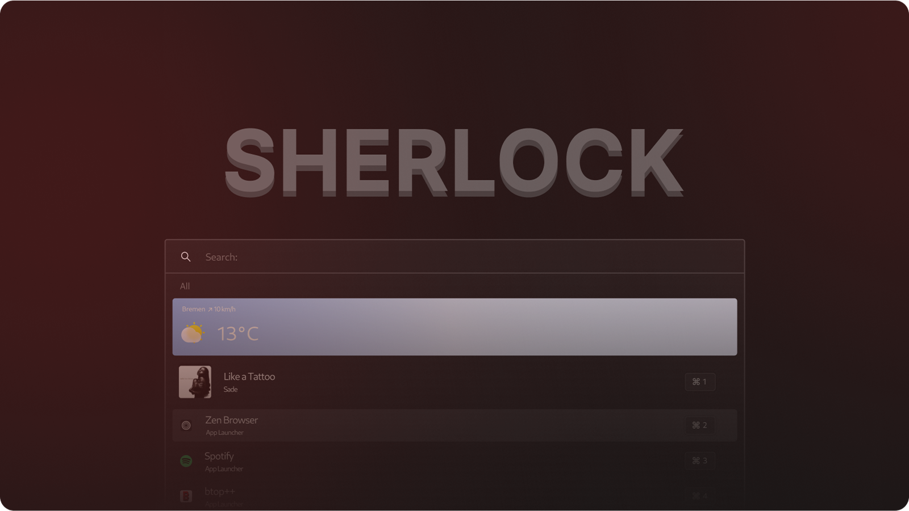

<div align="center" style="text-align:center; border-radius:10px;">
  <picture>
    <source media="(prefers-color-scheme: dark)" srcset="assets/logo-dark.svg">
    <source media="(prefers-color-scheme: light)" srcset="assets/logo-light.svg">
    
  </picture>

  [](https://discord.gg/AQ44g4Yp9q)
  <picture>
    
  </picture>
</div>

Sherlock is a fast, extensible application launcher for Wayland, built with
GPUI. Sherlock's widgets inherit from launcher configurations. There
are several launcher types, including a [File Search](), [Emoji Picker](),
and [Translator]().

> [!NOTE]
> Sherlock has been rewritten entirely, to be compatible with GPUI instead of
> GTK4. This included major refactorings, causing some changes in the
> configuration files.

> [!WARNING]
> Disclaimer: Due to GPUI's develompent primarily focusing on Zed, some
> features may not be complete yet. In Sherlock, this is barely noticeable
> though.

# Getting Started

## Dependencies

- `gtk-4-layer-shell` - [Gtk4 Layer Shell](https://github.com/wmww/gtk4-layer-shell)
- `dbus` - (Used to get currently playing song)
- `openssl` - (Used for retrieving Spotify album art)
- `libssl-dev`

Additionally, if you're building from source, you will need:

- `rust` - [How to install rust](https://www.rust-lang.org/tools/install)
- `git` - [How to install git](https://github.com/git-guides/install-git)

<br><br>

## Installation

### <ins>Arch Linux</ins>

If you're using Arch Linux, you can install the pre-built binary package with the following command:

```bash
yay -S sherlock-launcher-bin
```

Or install the community-maintained git build with the following command:

```bash
yay -S sherlock-launcher-git

```

### <ins>From Source</ins>

To build Sherlock Launcher from source, follow these steps.<br>
Make sure you have the necessary dependencies installed:

<details>
<summary><strong>Dependencies</strong></summary>

- `rust` - [How to install rust](https://www.rust-lang.org/tools/install)
- `git` - [How to install git](https://github.com/git-guides/install-git)
- `gtk-4-layer-shell` - [Gtk4 Layer Shell](https://github.com/wmww/gtk4-layer-shell)
- `dbus` - (Used to get currently playing song)
- `libsqlite3-dev`

</details>


<details>
<summary><strong>Build Steps:</strong></summary>

1. **Clone the repository**:

    ```bash
    git clone https://github.com/skxxtz/sherlock.git
    cd sherlock
    ```

2. **Install necessary Rust dependencies**:

    Build the project using the following command:

    ```bash
    cargo build --release
    ```

3. **Install the binary**:

    After the build completes, install the binary to your system:

    ```bash
    sudo cp target/release/sherlock /usr/local/bin/
    ```

4. **(Optional) Remove the build directory:**

    You can optionally remove the source code directory.

    ```bash
    rm -rf /path/to/sherlock
    ```

</details>

### <ins>Build Debian Package</ins>

To build a `.deb` package directly from the source, follow these steps:<br>
Make sure you have the following dependencies installed:

<details>
<summary><strong>Dependencies</strong></summary>

- `rust` - [How to install rust](https://www.rust-lang.org/tools/install)
- `git` - [How to install git](https://github.com/git-guides/install-git)
- `gtk-4-layer-shell` - [Gtk4 Layer Shell](https://github.com/wmww/gtk4-layer-shell)

</details>

<details>
<summary><strong>Build Steps:</strong></summary>

1. **Install the `cargo-deb` tool**:

    First, you need to install the `cargo-deb` tool, which simplifies packaging Rust projects as Debian packages:

    ```bash
    cargo install cargo-deb
    ```

2. **Build the Debian package**:

    After installing `cargo-deb`, run the following command to build the `.deb` package:

    ```bash
    cargo deb
    ```

    This will create a `.deb` package in the `target/debian` directory.

3. **Install the generated `.deb` package**:

    Once the package is built, you can install it using:

    ```bash
    sudo dpkg -i target/debian/sherlock-launcher_*_amd64.deb
    ```

    > You can use tab-completion to auto complete the exact file name.

</details>

### <ins>Nix</ins>

#### Non-Flakes Systems

Sherlock is available in `nixpkgs/unstable` as `sherlock-launcher`. If you're installing it as a standalone package you'll need to do the [config setup](#config-setup) yourself.

#### Flakes & Home-Manager

A module for Sherlock is available in home manager. You can find it's configuration [here](https://github.com/nix-community/home-manager/blob/master/modules/programs/sherlock.nix). If you want to use the latest updates and module options, follow the steps below.

<details>
<summary><strong>Home-Manager Example Configuration</strong></summary>

Add the following your `inputs` of `flake.nix` if you want to use the latest upstream version of sherlock.

```nix
sherlock = {
    url = "github:Skxxtz/sherlock";
    inputs.nixpkgs.follows = "nixpkgs";
};
```

Home-Manager config:

```nix
programs.sherlock = {
  enable = true;

  # to run sherlock as a daemon
  systemd.enable = true;

  # If wanted, you can use this line for the _latest_ package. / Otherwise, you're relying on nixpkgs to update it frequently enough.
  # For this to work, make sure to add sherlock as a flake input!
  # package = inputs.sherlock.packages.${pkgs.system}.default;

  # config.toml
  settings = {};

  # sherlock_alias.json
  aliases = {
    vesktop = { name = "Discord"; };
  };

  # sherlockignore
  ignore = ''
    Avahi*
  '';

  # fallback.json
  launchers = [
    {
      name = "Calculator";
      type = "calculation";
      args = {
        capabilities = [
          "calc.math"
          "calc.units"
        ];
      };
      priority = 1;
    }
    {
      name = "App Launcher";
      type = "app_launcher";
      args = {};
      priority = 2;
      home = "Home";
    }
  ];

  # main.css
  style = /* css */ ''
    * {
      font-family: sans-serif;
    }
  '';
};
```

</details>

#### Flakes without Home-Manager

To install the standalone package, add `sherlock.packages.${pkgs.system}.default` to `environment.systemPackages`/`home.packages`. You will need to create the configuration files yourself, see below.

## 3. Post Installation

### **Config Setup**

After the installation is completed, you can set up your configuration files. The location for them is `~/.config/sherlock/`. Depending on your needs, you should add the following files:

1. [**config.toml**](https://github.com/Skxxtz/sherlock/blob/main/docs/examples/config.toml): This file specifies the behavior and defaults of your launcher. Documentation [here](https://github.com/Skxxtz/sherlock/blob/main/docs/config.md).
2. [**fallback.json**](https://github.com/Skxxtz/sherlock/blob/main/docs/examples/fallback.json): This file specifies the features your launcher should have. Documentation [here](https://github.com/Skxxtz/sherlock/blob/main/docs/launchers.md).
3. [**sherlock_alias.json**](https://github.com/Skxxtz/sherlock/blob/main/docs/examples/sherlock_alias.json): This file specifies aliases for applications. Documentation [here](https://github.com/Skxxtz/sherlock/blob/main/docs/aliases.md).
4. [**sherlockignore**](https://github.com/Skxxtz/sherlock/blob/main/docs/examples/sherlockignore): This file specifies which applications to exclude from your search. Documentation [here](https://github.com/Skxxtz/sherlock/blob/main/docs/sherlockignore.md).
5. [**main.css**](https://github.com/Skxxtz/sherlock/blob/main/resources/main.css): This file contains your custom styling for Sherlock.

As of `version 0.1.11`, Sherlock comes with the `init` subcommand to automatically create your config. It will create versions of the files above, populated with the default values. Additionally, it will create the `icons/`, `scripts/`, and `themes/` subdirectories. All you have to do is run the following command:

```bash
sherlock init
```

# Contributing

Contributions are welcome! Please follow these guidelines:

**Branching**

- `main` – stable releases only
- Feature branches: `feat/your-feature`
- Bug fixes: `fix/description`

**Before opening a PR**

```sh
cargo fmt
cargo clippy -- -D warnings
cargo test
```

**Releasing**

Releases are automated bia GitHub Actions on version tags:

```sh
git tag 0.x.0
git push origin v0.x.0
```

# License

GNU GENERAL PUBLIC LICENSE –  see [LICENSE]() for details
