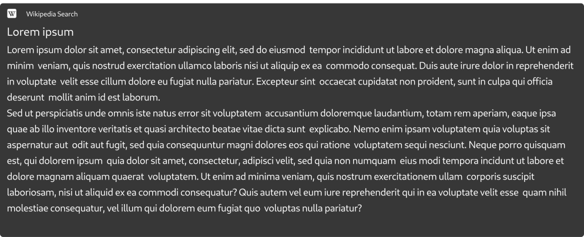
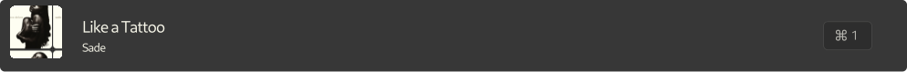

# Launchers

Launchers are the backbone of Sherlock. Each of Sherlock's items – including
applications, custom commands, or functional widgets like the weather – inherit
from a Launcher. The `fallback.json` file can be thought of as something like
Sherlock's "package manager", used to toggle specific features on and off or to
customize their behavior.<br>

The default location for the `fallback.json` file is in your Sherlock config
directory (`/home/user/.config/sherlock/`). If the file does not exist, you'll
be greeted with a warning and the default fallback file – [packaged in the
binary](https://github.com/Skxxtz/sherlock/blob/main/resources/fallback.json) –
will be used.<br>

> **Example File:** [fallback.json](https://github.com/Skxxtz/sherlock/blob/main/docs/examples/fallback.json)
<br>

The launcher can be of the following types:<br>

- **[App Launcher](#app-launcher):** Launches your apps.
- **[Bookmark Launcher](#bookmark-launcher):** Finds and launches your browser bookmarks.
- **[Category Launcher](#category-launcher):** Groups your launchers.
- **[Web Launcher](#web-launcher):** Opens the ``{keyword}`` in your default web browser. The used search engine is configurable and the most common search engines are included.
- **[Calculator](#calculator):** Converts your input into a math equation and displays its result. On Return, it also copies the result into the clipboard.
- **[Clipboard Launcher](#clipboard-launcher):** Checks if your clipboard currently holds a URL. On Return, it opens the URL in the default web browser. Also displays hex and rgb colors.
- **[Command](#command-launcher):** This field can execute commands that do not rely on the ``{keyword}`` attribute (such as connecting to a specific wifi).
- **[Debug](#debug-launcher):** This launcher allows you to run debug commands from within Sherlock. For example clearing the cache or app count.
- **[Emoji](#emoji-picker):** This launcher allows you to search and pick emojis.
- **[Bulk Text](#bulk-text):** The Bulk Text is a way to launch a custom script/application in an async form and to display its result in a widget.
- **[Teams Event Launcher](#teams-event):** This launcher is capable of joining Microsoft Teams meetings that are scheduled to begin between 5mins ago and in 15mins.
- **[Theme Picker](#theme-picjer):** This launcher shows available themes and sets them as your default.
- **[Music Player Launcher](#music-player):** This launcher shows the currently playing song with artist and toggles playback on return.
- **[Process Terminator](#process-terminator):** This utility shows user processes and terminates them on return.
- **[Pomodoro Timer](#pomodoro-timer):** This utility shows a pomodoro-timer focus utility.
- **[Weather Launcher](#weather-launcher):** It shows the current weather condition in your selected region or city.

## Shared Launcher Attributes

`[UI]` - used for UI <br>
`[FC]` - used to specify behaviour <br>

### Required

| Attribute   | Type | Description |
|-------------|------|-------------|
| `type`      | `[FC]` | Specifies the tile and functionality to be used for this Launcher. |
| `args`      | `[FC]` | Arguments specific to the `type`. Can be left empty. |
| `priority`  | `[FC]` | Defines the display order of launcher elements at startup. **A value of 0 means the launcher will only be shown if the `alias` is active.**|

### Optional

| Attribute   | Type | Description |
|-------------|------|-------------|
| `name`      | `[UI]` | The name of the category the tiles belong to. This name will appear under the app’s name. It is required but can be left empty. |
| `alias`     | `[FC]` | The command used to search within this category. |
| `home`      | `[FC]` | Determines if the elements of this launcher are displayed at startup. Can be set to `Home`, `OnlyHome`, `Persist`, or `Search` (default)|
| `async`     | `[FC]` | Indicates whether the launcher should run asynchronously. This is used in `Bulk Text`. |
| `on_return`     | `[FC]` | Specifies what to do if return is pressed on the tile. |
| `spawn_focus`     | `[FC]` | Determines whether the tile should automatically gain focus when it appears as the first item in the list. |
| `shortcut`     | `[FC]` | Determines whether the tile should have the shortcut indicator on the side. |
| `actions`     | `[FC]` | Sets custom actions for launchers or – if applicable – its children. Examples: [Debug Launcher](#debug-launcher), Detailed: [Actions](#actions)|
| `variables`     | `[FC]` | Enables custom variable fields in the search bar, allowing you to define runtime parameters for commands. Detailed: [Variable Fields](#variable-fields)|

## Complex Attributes

### Actions

Actions are used to define entries within Sherlock's context menu. They are defined as an array of actions, following a simple structure:

```json
{
    "name": "display name",
    "exec": "should be executed",
    "icon": "display icon",
    "method": "some method",
    "exit": false,
}
```

**Arguments**:

- `name`: Defines the name to be shown in the context menu
- `icon`: Defines the icon to be shown in the context menu
- `exec`: The argument to be processed by `method`. For instance, in case of `app_launcher`, this should be the app with its flags
- `method`: The function to be executed whenever you activate this menu entry
- `exit`: Whether sherlock should close after completing the action

### Variable Fields

<div align="center" style="text-align:center; border-radius:10px;">
  <picture>
    
  </picture>
</div>
<br>

Variable fields are text input fields that appear in the search bar to allow
the definition of runtime arguments for commands you want to run. For example,
this can be used to run a command like `nordvpn c [location]` easily from
within sherlock.

There are currently two types of fields:

1. `string_input`: A plain text input
2. `password_input`: An obfuscated input

When specifying a variable field, it is important to also give it a name. This
name will serve two purposes – it will show as the placeholder text for the
input field and it will be the variable name. The resulting variable field will
be something similar to this: `{"string_input": "variable name"}`. The content
of the variable fields will be accessible in the `exec` parameter of the command.

> [!TIP]
> Check the notation for replacement variables [replacement variables 🔗](#replacement-variables)

**Example:**

```json
    {
        "name": "Utilities",
        "type": "command",
        "args": {
            "commands": {
                "NordVPN": {
                    "variables": [
                        {"string_input": "location"}
                    ],
                    "icon": "nordvpn",
                    "exec": "nordvpn c {variable:location}",
                    "search_string": "nordvpn"
                },
                "NordVPN Daemon": {
                    "variables": [
                        {"password_input": "sudo"}
                    ],
                    "icon": "nordvpn",
                    "exec": "sudo -S systemctl start nordvpnd",
                    "search_string": "nordvpn daemon"
                }
            }
        },
        "priority": 1
    }
```

### Binds

This feature allows for custom binds to be set to some launchers. The related
functions are listed in the launcher description. Currently supported launchers
are:

- Pomodoro Timer

Binds have the following structure:

```json
"binds": [
    {"bind": "control+r", "callback": "reload"},
    {"bind": "control+x", "callback": "example2"},
    {"bind": "control+c", "callback": "example3"}
]
```

**Arguments:**

- **`bind`:** Defines the bind to be used with the specified action
- **`callback`:** Defines the internal function to be executed. This function
  depend on the launcher and is listed in the `Inner Function` section for available
  launchers

#### Available Methods

- `category`: Uses the `exec` to open a new mode
- `app_launcher`: Opens the `exec` as an app
- `web_launcher`: Opens the `exec` as a link in your default web browser
- `command`: Opens the `exec` as a command
- `debug`: Matches the `exec` against
  - `clear_cache`: To clear the application's cache
  - `show_errors`: To switch to the error/warning screen
  - `reset_counts`: To reset the execution counter

---

## App Launcher

<div align="center" style="text-align:center; border-radius:10px;">
  <picture>
    
  </picture>
</div>
<br>

```json
{
    "name": "App Launcher",
    "alias": "app",
    "type": "app_launcher",
    "args": {
        "use_keywords": true
    },
    "priority": 2,
    "home": "Home"
}
```

### Arguments (args)

(optional)<br>

1. `use_keywords`: This boolean value allows you to specify whether Sherlock
   should only search for the name of the app or also use the keywords provided
   in the .desktop file.

<br>

## Bookmark Launcher

<div align="center">
  <picture>
    
  </picture>
</div>
<br>

```json
{
    "name": "Bookmarks",
    "type": "bookmarks",
    "args": {
        "icon": "sherlock-bookmark",
        "icon_class": "reactive"
    },
    "priority": 3,
    "home": "Search"
}
```

<br>

## Category Launcher

<div align="center" style="text-align:center; border-radius:10px;">
  <picture>
    
  </picture>
</div>
<br>

```json
{
    "name": "Categories",
    "alias": "cat",
    "type": "categories",
    "args": {
        "Kill Processes": {
            "icon": "sherlock-process",
            "icon_class": "reactive",
            "exec": "kill",
            "search_string": "terminate;kill;process"
        },
        "Power Menu": {
            "icon": "battery-full-symbolic",
            "icon_class": "reactive",
            "exec": "pm",
            "search_string": "powermenu;"
        }
    },
    "priority": 3,
    "home": "Home"
}
```

### Arguments (args)

**commands**:<br>
(required)<br>

1. `name field`: the name you want to have displayed for the category
2. `icon`: the icon-name for the icon to display
<br>

(optional)<br>

1. `icon_class`: Sets the css class for the icon to style it according to your theme
2. `search_string`: the string to match to on search
3. `exec`: the alias of the launcher you want to execute. If left empty, will not do anything
<br>

### Supported Browsers

Currently these are the supported launchers. It is beneficiary to set the `browser` key in the `default_apps`section.

| Browser   | Name in `config.toml`                                      |
|-----------------|------------------------------------------|
| **Zen Browser**      | `zen`, `zen-browser`, `/opt/zen-browser-bin/zen-bin %u` |
| **Brave**      | `brave`, `brave %u` |
| **Firefox**      | `firefox`, `/usr/lib/firefox/firefox %u` |
| **Chrome**      | `chrome`, `google-chrome`, `/usr/bin/google-chrome-stable %u` |
| **Thorium**      | `thorium`, `/usr/bin/thorium-browser %u` |

<br>

## Web Launcher

<div align="center">
  <picture>
    
  </picture>
</div>
<br>

```json
{
    "name": "Web Search",
    "display_name": "Google Search",
    "tag_start": "{keyword}",
    "tag_end": "{keyword}",
    "alias": "gg",
    "type": "web_launcher",
    "args": {
        "search_engine": "google",
        "icon": "google"
    },
    "priority": 100
}
```

### Arguments (args)

**`search_engine`** (required):
Can be either of the following:

| Search Engine   | URL                                      |
|-----------------|------------------------------------------|
| **Custom**      | `https://www.example.com/search={keyword}` |
| **Google**      | `https://www.google.com/search?q={keyword}` |
| **Bing**        | `https://www.bing.com/search?q={keyword}` |
| **DuckDuckGo**  | `https://duckduckgo.com/?q={keyword}`    |
| **Yahoo**       | `https://search.yahoo.com/search?p={keyword}` |
| **Baidu**       | `https://www.baidu.com/s?wd={keyword}`   |
| **Yandex**      | `https://yandex.com/search/?text={keyword}` |
| **Ask**         | `https://www.ask.com/web?q={keyword}`    |
| **Ecosia**      | `https://www.ecosia.org/search?q={keyword}` |
| **Qwant**       | `https://www.qwant.com/?q={keyword}`     |
| **Startpage**   | `https://www.startpage.com/sp/search?q={keyword}` |

**`icon`** (required):<br>
Sets the icon-name the launcher should show.

<br>

## Calculator

<div align="center">
  
  <br />
  
</div>
<br>

```json
{
    "name": "Calculator",
    "type": "calculation",
    "args": {
        "capabilities": [
            "calc.math",
            "calc.units"
        ]
    },
    "priority": 1
}
```

### Arguments (args)

**`capabilities`** (optional):<br>
Specifies what the launcher should parse:

- **`calc.math`** - displays the solutions to mathematical problems
- **`calc.lengths` (unit)** - displays the solutions to length transformations
- **`calc.weights` (unit)** - displays the solutions to weight transformations
- **`calc.volumes` (unit)** - displays the solutions to volume transformations
- **`calc.temperatures` (unit)** - displays the solutions to temerature transformations
- **`calc.currencies` (unit)** - displays the solutions to currency transformations

> **💡 Note:** You can also use `calc.units` to use all available unit transformations

<br>

## Clipboard Launcher

<div align="center">
  
  <br>
  
</div>
<br>

```json
{
    "name": "Clipboard",
    "type": "clipboard-execution",
    "args": {
        "capabilities": [
            "url",
            "colors.hex",
            "colors.rgb",
            "colors.hsl",
            "calc.math",
            "calc.lengths",
            "calc.weights",
            "calc.temperatures"
        ]
    },
    "priority": 1,
    "home": "Home"
}
```

### Arguments (args)

**`capabilities`** (optional):<br>
Specifies what the launcher should parse:

- **`url`** - parses URLs to launch in the web browser
- **`colors.hex`** - displays hex colors in Sherlock. Format supports #[a-fA-F0-9]{6,8}
- **`colors.rgb`** - displays rgb colors in Sherlock. Format supports optional rgb prefix and optional parentheses.
- **`colors.hsl`** - displays hsl colors in Sherlock. Format supports optional hsl prefix and optional parentheses.
- **`calc.math`** - displays the solutions to mathematical problems
- **`calc.lengths` (unit)** - displays the solutions to length transformations
- **`calc.weights` (unit)** - displays the solutions to weight transformations
- **`calc.volumes` (unit)** - displays the solutions to volume transformations
- **`calc.temperatures` (unit)** - displays the solutions to temerature transformations
- **`calc.currencies` (unit)** - displays the solutions to currency transformations

> **💡 Note:**
> You can also use
>
> - `colors.all` to use all available color formats
> - `calc.units` to use all available unit transformations

<br>

## Command Launcher

```json
{
    "name": "Example Command",
    "alias": "ex",
    "type": "command",
    "args": {
        "commands": {
            "command name": {
                "icon": "icon-name",
                "icon_class": "reactive",
                "exec": "command to execute",
                "search_string": "examplecommand",
                "tag_start": "{keyword}",
                "tag_end": "{keyword}"
            },
            "command2": {
                "icon": "icon-name",
                "exec": "command to execute",
                "search_string": "examplecommand",
                "tag_start": "{keyword}",
                "tag_end": "{keyword}"
            }
        }
    },
    "priority": 5
}
```

### Arguments (args)

**commands** (required):<br>
Has following fields of its own:

1. `name field` / the name of the application (is the field where command name is the value currently)
2. `icon` / the icon-name for the icon to display
3. `icon_class` / Sets the css class for the icon to style it according to your theme
4. `exec` / the command to execute
5. `search_string` / the string to match to on search
6. `tag_start` / specifies what will be displayed in the start tag
7. `tag_end` / specifies what will be displayed in the end tag

### Replacement Variables

Replacement variables allow you to dynamically insert values into commands
based on the user's input or environment.

#### Available Variables

##### 1. `{keyword}`

Replaces with the text the user searched for.

**Example:**
`https://www.example.com/search?q={keyword}`

##### 2. `{terminal}`

Replaces with the user-defined or automatically detected default terminal.

> [!TIP]
> Most terminals close immediately after the launched process finishes. To prevent this, wrap your command like:
>
> ```
> {terminal} sh -c "[YOUR COMMAND]; exec $SHELL" 
> ```
>
> **Example:**
>
> ```
> "exec": "{terminal} sh -c \"ssh {variable:user}@{variable:host}; exec $SHELL\"",
> ```

##### 3. `{variable:<name>}`

Inserts the value of a runtime-defined variable. Only works if the variable
field is defined (see [Variable Fields](#variable-fields))

**Example:**

With defined variable field:

```json
{
    "variables": [
               {"string_input": "query"}
    ],
    "exec": "https://example.com/search?q={variable:query}"
}
```

##### 4. `{prefix[<variable name>]:<prefix text>}`

A *conditional prefix variable*.

- If the variable **exists and has a value**, the prefix text will be inserted.
- If the variable is **undefined**, the entire replacement (including the prefix) becomes an empty string.

This is useful for optional flags or when you want to either query on a website
or go to its home page.

**Example:**

With defined variable fields:

```json
{
    "variables": [
               {"string_input": "query"}
    ],
    "exec": "https://example.com/{prefix[query]:search?q=}{variable:query}"
}
```

##### **Examples:**

```json
{
    "name": "SSH",
    "type": "command",
    "args": {
        "commands": {
            "SSH": {
                "icon": "sherlock-link",
                "exec": "{terminal} ssh {custom_text:User:}@{custom_text:Host:}",
                "search_string": "ssh"
            },
            "NordVPN": {
                "icon": "nordvpn",
                "exec": "{terminal} sh -c \"nordvpn c {custom_text:Server:}; exec $SHELL\"",
                "search_string": "nordvpn"
            },
            "NordVPN Daemon": {
                "icon": "nordvpn",
                "exec": "systemctl --user start nordvpnd",
                "search_string": "nordvpn daemon"
            }
        }
    },
    "priority": 1
}
```

<br>

## Debug Launcher

```json
{
    "name": "Debug",
    "type": "debug",
    "alias": "debug",
    "args": {
        "commands": {
            "Clear Cache": {
                "icon": "sherlock-process",
                "exec": "clear_cache",
                "search_string": "clear;cache;"
            },
            "Reset App Counts": {
                "icon": "sherlock-process",
                "exec": "reset_counts",
                "search_string": "reset;clear;counts;appcounts"
            }
        },
        "actions": [
            {
                "name": "Clear Cache",
                "icon": "sherlock-process",
                "exec": "clear_cache",
                "method": "debug"
            },
            {
                "name": "Reset App Counts",
                "icon": "sherlock-process",
                "exec": "reset_counts",
                "method": "debug"
            }
        ]
    },
    "priority": 0
}
```

### Arguments (args)

**commands** (required):<br>
Has following fields of its own:

1. `name field` / the name of the application (is the field where command name is the value currently)
2. `icon` / the icon-name for the icon to display
3. `icon_class` / Sets the css class for the icon to style it according to your theme
4. `exec` / the command to execute
5. `search_string` / the string to match on search
6. `tag_start` / specifies what will be displayed in the start tag
7. `tag_end` / specifies what will be displayed in the end tag

### Available Debug Commands

- `clear_cache`: Clears the files within the location set as cache.
- `reset_counts`: Resets the execution counter – the counter responsible for sorting based on activity.

<br>

## Emoji Picker

```json
{
    "name": "Emoji Picker",
    "type": "emoji_picker",
    "args": {
        "default_skin_tone": "Simpsons"
    },
    "priority": 4,
    "home": "Search"
}
```

### Arguments (args)

- `default_skin_tone`: Sets the default skin tone for emojies. Can be either one of those:
  - `Light`
  - `MediumLight`
  - `Medium`
  - `MediumDark`
  - `Dark`
  - `Simpsons` (Default)

## Bulk Text

<div align="center" style="text-align:center; border-radius:10px;">
  <picture>
    
  </picture>
</div>
<br>

```json
{
    "name": "Wikipedia Search",
    "alias": "wiki",
    "type": "bulk_text",
    "async": true,
    "on_return": "copy",
    "args": {
        "icon": "wikipedia",
        "exec": "~/.config/sherlock/scripts/sherlock-wiki",
        "exec-args": "{keyword}"
    },
    "priority": 0,
    "shortcut": false
}
```

### Arguments (args)

**`icon`** (required):<br>
Specifies the icon shown for the command.<br>

**`exec`** (required):<br>
Specifies the program that should be run. **Note:** that its probably suitable to run it asynchronously. To do that, set the `async` attribute to `true`. <br>

**`exec-args`** (optional):<br>
Specifies the arguments to pass along to the `exec` program.<br>

> The provided snippet works with the project [sherlock-wiki](https://github.com/Skxxtz/sherlock-wiki)

<br>

## Teams Event

<div align="center" style="text-align:center; border-radius:10px;">
  <picture>
    
  </picture>
</div>
<br>

> **🚨 Warning:** Currently only supports Thunderbird calendar events

```json
{
    "name": "Teams Event",
    "type": "teams_event",
    "args": {
        "icon": "teams",
        "event_date": "now",
        "event_start": "-5 minutes",
        "event_end": "+15 minutes"
    },
    "priority": 1,
    "home": "Home"
}
```

### Arguments (args)

**`icon`** (optional):<br>
Specifies the icon shown for the event.<br>

**`event_date`** (optional):<br>
Specifies the date for the event lookup<br>

**`event_start`** (optional):<br>
Specifies the offset from the `date` parameter.<br>

**`event_end`** (optional):<br>
Specifies the second offset from the `date` parameter.<br>

<br>

## Theme Picker

```json
{
    "name": "Theme Picker",
    "type": "theme_picker",
    "args": {
        "location": "~/.config/sherlock/themes/"
    },
    "priority": 4,
    "home": "Home"
}
```

### Arguments (args)

**`location`** (optional):<br>
Specifies your theme directory. Defaults to `~/.config/sherlock/themes/`.

<br>

## Music Player

<div align="center" style="text-align:center; border-radius:10px;">
  <picture>
    
  </picture>
</div>
<br>

```json
{
    "name": "Spotify",
    "type": "audio_sink",
    "args": {},
    "async": true,
    "priority": 1,
    "home": "Home",
    "spawn_focus": false,
    "actions": [
        {
            "name": "Skip",
            "icon": "media-seek-forward",
            "exec": "playerctl next",
            "method": "command"
        },
        {
            "name": "Previous",
            "icon": "media-seek-backward",
            "exec": "playerctl previous",
            "method": "command"
        }
    ],
    "binds": [
        {
            "bind": "control+p",
            "callback": "playpause",
            "exit": false
        },
        {
            "bind": "control+l",
            "callback": "next",
            "exit": false
        },
        {
            "bind": "control+h",
            "callback": "previous",
            "exit": false
        }
    ]
}
```

### Inner Functions

These functions can be called either using actions with the `inner.[function
name]` method or by using bind callbacks `"callback": "[function name]"`.

1. **`playpause`:** toggles the playback
2. **`next`:** moves to the next song
3. **`previous`:** moves to the previous song
4. **`unbind`:** unbinds the specified key. This can be useful if you want to unbind return

<br>

## Process Terminator

<div align="center" style="text-align:center; border-radius:10px;">
  <picture>
    
  </picture>
</div>
<br>

```json
{
    "name": "Kill Process",
    "alias": "kill",
    "type": "process",
    "args": {},
    "priority": 6,
    "home": "Search"
}
```

<br>

## Pomodoro Timer

<div align="center">
    
    <br />
    
</div>
<br>

```json
{
    "name": "Pomodoro Timer",
        "type": "pomodoro",
        "args": {
            "program": "~/.config/sherlock/scripts/sherlock-pomodoro",
            "socket": "/tmp/sherlock-pomorodo.sock",
            "style": "minimal"
        },
        "priority": 0,
        "home": "Home",
        "spawn_focus": false,
        "binds": [
        {
            "bind": "control+r",
            "callback": "reset"
        }
        ],
        "actions": [
        {
            "name": "Reset",
            "icon": "edit-undo",
            "exec": "",
            "method": "inner.reset",
            "exit": false
        },
        {
            "name": "Toggle",
            "icon": "media-playback-start",
            "exec": "",
            "method": "inner.toggle",
            "exit": false
        }
        ]
}
```

> [!WARNING]
> This launcher depends on the [sherlock-pomodoro](https://github.com/Skxxtz/sherlock-pomodoro) project – a fast, and efficient pomodro client, built for Sherlock.

### Arguments (args)

**`program`** (required):<br>
Specifies the location of the pomodoro client

**`socket`** (required):<br>
Specifies the socket over which to communicate with the client. If the
`sherlock-pomorodo` project is used, this location is the same as listed above.

**`style`** (optional):<br>
Specifies the style of the pomodoro timer. (1) Minimal, (2) Normal (default)

### Inner Functions

These functions can be called either using actions with the `inner.[function
name]` method or by using bind callbacks `"callback": "[function name]"`.

1. **`reset`:** resets the timer
2. **`toggle`:** toggles the timer
3. **`unbind`:** unbinds the specified key. This can be useful if you want to unbind return

<br>

## Weather Launcher

<div align="center" style="text-align:center; border-radius:10px;">
  <picture>
    
  </picture>
</div>
<br>

```json
{
    "name": "Weather",
    "type": "weather",
    "args": {
        "location": "berlin",
        "update_interval": 60,
        "icon_theme": "Sherlock",
        "show_datetime": false
    },
    "priority": 1,
    "home": "OnlyHome",
    "async": true,
    "shortcut": false,
    "spawn_focus": false
}
```

### Arguments (args)

**`location`** (required):<br>
Specifies the location for which the weather should be gathered.<br>

**`update_interval`** (optional):<br>
Specifies how often you want to update the weather. In minutes.<br>

**`icon_theme`** (optional):<br>
Specifies whether Sherlock's fallback icon theme should be used or the system icon theme.<br>

**`show_datetime`** (optional):<br>
Specifies whether the current date and time should be shown alongside the weather information.<br>
